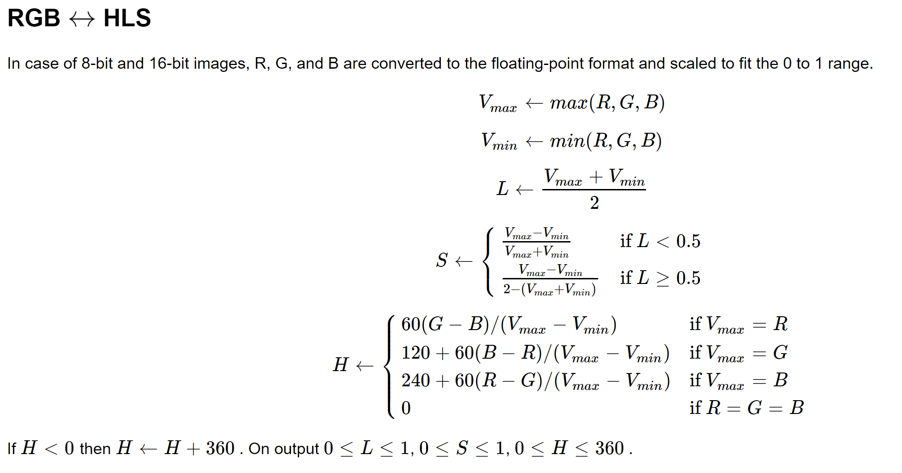

# Vision Lib Documentation #
first you need to import the vision library:
´´´
import src/Vision/vision
´´´

## Functions ##

### get_warp_matrix(frame,shape,pad,samples)
this function returns the warping matrix used by cv2.warpPerspective to reframe the map to the environement of interest

## Details

